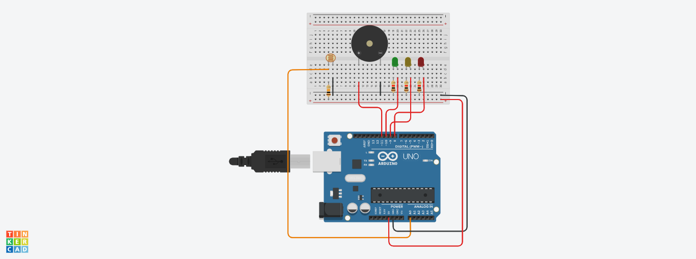

<h1 align='center'>
    Arduino Wine Quality Monitor
<h1>

<h3> 
    Este é um projeto de monitoramento de qualidade de vinhos usando Arduino, desenvolvido para atender às necessidades de uma vinícola tradicional que busca expandir seus negócios para o comércio eletrônico, mantendo a mesma experiência de qualidade oferecida em sua loja física.
</h3>

  <a href="#participantes">Participantes</a> |
  <a href="#objetivos">Objetivos</a> |
  <a href="#hardware-utilizado">Hardware Utilizado</a> |
  <a href="#funcionamento-do-codigo">Funcionamento do Código</a> |
  <a href="#instalacao-e-utilizacao">Instalação e Utilização</a> |
  <a href="#aviso">Aviso</a> 

## Participantes
* João Henrique Sena Hoffmann (RM - 550763)
* Lucas Ludovico Cabral (RM - 554589)
* Vinicius Fernandes Tavares Bittencourt (RM - 558909)
* Weslley Oliveira Cardoso (RM - 557927)

## Objetivos
O objetivo deste projeto é capturar a iluminação ambiente no ambiente de armazenamento de vinhos e monitorar a qualidade com base nesse fator. A iluminação é um fator crítico na preservação da qualidade dos vinhos, e este sistema visa alertar os responsáveis quando a iluminação está abaixo dos níveis recomendados.

## Hardware Utilizado
* Arduino Uno
* Sensor de Luminosidade (LDR)
* LEDs (Verde, Amarelo e Vermelho)
* Buzzer

## Funcionamento do Código
O código lê os valores do sensor de luminosidade (LDR) e os converte em uma porcentagem, representando a intensidade da luz ambiente. Com base nesse valor, o sistema acende LEDs e toca um buzzer para indicar a qualidade da iluminação, de acordo com os seguintes critérios:
* Se a iluminação estiver acima de 50% do recomendado, o LED verde é aceso.
* Se a iluminação estiver entre 50% e 10% do recomendado, o LED amarelo é aceso e o buzzer emite pequenos toques para alerta.
* Se a iluminação estiver abaixo de 10% do recomendado, o LED vermelho é aceso e o buzzer toca continuamente por 3 segundos como alerta crítico.

O código é executado em um loop contínuo, monitorando constantemente a iluminação ambiente e fornecendo feedback visual e sonoro sobre a qualidade da mesma.

## Instalação e Utilização
* Conecte os componentes conforme o esquema de ligação.
* Carregue o código para a placa Arduino.
* Certifique-se de que o sensor de luminosidade esteja posicionado em um local representativo da iluminação do ambiente de armazenamento de vinhos.
* Ligue a alimentação da placa Arduino.
* Observe os LEDs e ouça o buzzer para determinar a qualidade da iluminação ambiente.

## Aviso
Este projeto é uma prova de conceito e deve ser adaptado e aprimorado conforme as necessidades específicas da aplicação e do ambiente de uso.